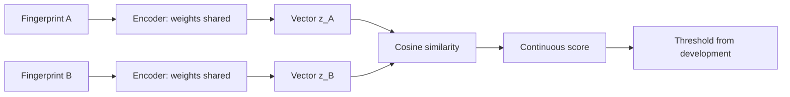

# Fingerprint matching pipeline — explanation and worked examples

2026-10-10. Educational examples below use invented vectors and counts; they
are not experiments or measurements of this project.

## From pixels to a decision

A vision encoder transforms image pixels into numerical features. A CNN learns
local filters; a vision transformer processes image patches. Either can supply
an **embedding**, a fixed-length vector representing the print. The useful
property for verification is that independent impressions of the same finger
produce similar vectors while impostors are separated. A generic encoder's
features do not automatically have this property. [DeepPrint](https://arxiv.org/abs/1904.01099)
learns a fingerprint representation using fingerprint domain knowledge; it is
a fingerprint-specific precedent, not a plug-in performance guarantee.

A **Siamese** architecture processes A and B with the same encoder and shared
weights. It does not train unrelated encoders for the two sides. At inference,
compare the embeddings with cosine similarity or a trained match head, then
apply a threshold. The vectors are an internal representation, the similarity
is a continuous score, and the threshold converts that score into a decision.

With unit-length vectors, cosine similarity is their dot product. For the toy
vectors `a=(1,0)`, `p=(0.96,0.28)` and `n=(0,1)`, all norms equal one, and
`cos(a,p)=0.96` while `cos(a,n)=0`. A hypothetical threshold of 0.8 accepts the
first comparison and rejects the second. This illustrates the mechanism only;
0.8 is not a proposed project threshold. Cosine similarity is not a calibrated
probability, and a VLM's natural-language confidence is not automatically a
biometric score.

## What training changes

**Metric learning** changes the encoder so genuine samples become closer and
impostors become farther apart. A contrastive objective uses genuine/impostor
pairs. A triplet objective uses an anchor A, a positive P from the same finger,
and a negative N from another subject at the same finger position.

One squared-distance triplet formulation is
`L = max(0, ||z_A-z_P||² - ||z_A-z_N||² + margin)`.
For invented squared distances 0.8 and 0.4 and a margin of 0.2, the loss is
0.6: the positive is currently farther away than the negative. Training should
reduce this violation. A pair/BCE head instead learns genuine/impostor labels;
different objectives can be tested as separate choices. [FaceNet, §3.1](https://arxiv.org/html/1503.03832v3)
explains the triplet mechanism for faces; transferring the idea does not
transfer its reported performance to fingerprints.

Fine-tuning a model to output the text “same” or “different” trains a different
output behavior from directly optimizing fingerprint embeddings. Likewise,
training on VeriFinger scores is **teacher-score supervision**, while training
on genuine/impostor labels uses identity-derived supervision. Neither is the
same as providing VeriFinger scores to the model at evaluation. We need to know
which objective Konain uses and keep teacher information from evaluation pairs
out of training and model selection.

## Where minutiae and attention enter

Minutiae are ridge endings and bifurcations, usually represented by coordinates,
orientations and available quality/type information. Coordinates need image
dimensions and a documented orientation convention. Normalizing coordinates
handles image size, but does not make positions invariant to movement or rotation.
An extractor can make mistakes, particularly in incomplete or poorly visible
ridge regions.

There are two attention designs to distinguish. **Within-print fusion** lets
image features and minutiae features exchange information to produce one
embedding per print. **Between-print correspondence** compares features from A
and B to learn which local structures correspond. [SuperGlue](https://arxiv.org/abs/1911.11763)
is an example of learned local-feature correspondence for general images; it
is architectural inspiration, not an established fingerprint result.

[MCC](https://cris.unibo.it/handle/11585/93153) encodes local spatial and directional
relationships around minutiae to reduce sensitivity to translation/rotation.
Its core representation does not require ridge counts. Invariance does not
eliminate nonrigid distortion, partial overlap or extraction errors. A model
combining images and structured minutiae is multimodal even if it never
generates language; whether that satisfies the professor's LLM/VLM framing
remains a research decision.

For a slap, a per-finger approach matches corresponding positions and fuses the
scores. Mean, sum and quality-aware fusion are different choices. A sum is
affected by missing fingers and score scales; document the missing-finger policy
and choose any learned fusion on training/development data. Konain reports
both the SDK's fused score and his per-finger sum. The vendor documents
segmentation and fusion capabilities, but that does not identify his SDK
settings or export details. [VeriFinger components](https://www.neurotechnology.com/verifinger-fingerprint-components.html)

## Evaluate scores at the right operating point

For a threshold T accepting scores `>= T`:

- `TAR = accepted genuine / all genuine comparisons`.
- `FAR = accepted impostors / all impostor comparisons`.
- `FRR = 1 - TAR`, under the stated failure-handling policy.
- ROC shows TAR versus FAR across thresholds; DET shows false rejection versus
  false acceptance; EER summarizes where those error rates are approximately equal.

For invented counts, accepting 190/200 genuine and 1/1,000 impostors gives
95% TAR and 0.1% observed FAR. Accuracy also depends on the genuine/impostor
mix: it can hide a security-relevant false-accept problem. Report both numerators
and denominators, how missing scores are handled, and the achieved test FAR at
the development-selected threshold.

Konain's screenshot has zero accepts among 2,100 impostors. One acceptance
would equal 0.047619%; a 0.1% target allows two observed acceptances, whereas
0.01% allows none. Zero observed errors does not demonstrate a zero underlying
FAR. At a fixed threshold with independent Bernoulli trials, solving
`(1-p)^2100=0.05` gives a one-sided 95% upper bound of about 0.14255%. This is an
illustrative calculation, not a confidence certificate for the screenshot:
the comparison dependence and threshold-selection history remain unknown.
Statistical background: [NIST TN 2119](https://nvlpubs.nist.gov/nistpubs/TechnicalNotes/NIST.TN.2119.pdf).

## Explain it back: short checks with answers

| Question | Answer |
|---|---|
| What changes during metric learning? | Encoder weights change the geometry of the embedding space. |
| Is cosine 0.96 a 96% match probability? | No; probability calibration would need separate validation. |
| Why share encoder weights? | Both inputs should be represented by the same learned mapping. |
| Does excluding exact pairs exclude subjects? | No; other pairs can reuse the same subjects or images. |
| Where do we choose the threshold? | Development data; then freeze it for final testing. |
| Does a readable image establish usable ridge detail? | No; decoding and biometric quality are different questions. |
| Do 1600×1500 pixels establish 500 PPI? | No; physical resolution needs acquisition metadata. |
| Must an image/minutiae transformer generate text? | No; an LLM/VLM connection is a separate research-framing choice. |

The existing `code/embed_verify.py` pools general vision features and compares
normalized embeddings. Its preprocessing calls `load_pil`, which autocontrasts,
square-pads and resizes to 448px. For a 1600px-wide slap, this reduces linear
detail by roughly 3.57× while preserving aspect ratio. Whether that loses
discriminative ridge information is a proposed preprocessing question, not a
causal explanation established by our inspection. No runner was changed.
