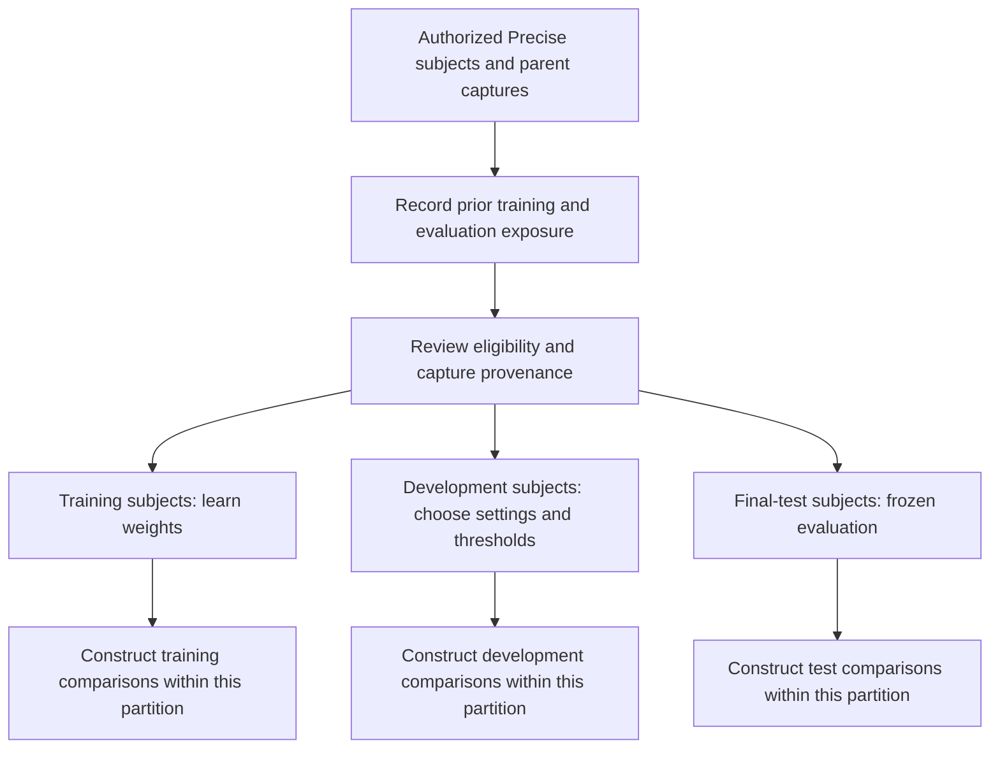

# Precise evaluation protocol sketch — awaiting joint review

2026-10-10. No subject assignments, split percentages, matching pairs, selected
model/loss, preprocessing parameters, thresholds or experiments are created by
this document. It completes the planning task while leaving decisions explicit.

## Evidence available now

The [local inspection report](../../reports/precise-inspection-20261010/README.md)
establishes header dimensions/mode and sampled readability, not acquisition
independence or physical PPI. Konain's message confirms that his baseline uses
full slaps with SDK fused scores and per-finger scores whose sum is also
evaluated. Filename subject/slap-type interpretation agrees with our parser.
Middle-token semantics, matching slap types, thumb inclusion and per-finger
position correspondence still need confirmation.

The supplied screenshot reports thresholds 48 (SDK fusion) and 79 (sum),
2,057/2,100 genuine accepts, and zero accepts among 2,100 impostors. The text
names 0.1% FAR; the screenshot requests 0.01%. These are collaborator-supplied
summary observations; raw scores and exact comparisons have not been audited.
“Skipped lines: 0” is a parsing observation, not proof that extraction failures
or missing fingers were absent before score export.

## Assign subjects before constructing comparisons

Let the subject sets be `S_train`, `S_dev` and `S_test`. Require every pairwise
intersection to be empty. Keep both hands, thumbs, sessions, sensors, original
captures, alternate encodings and all crops/augmentations from one subject in
the same partition. Create no cross-partition genuine or impostor pairs.
Check exact and decoded duplicates across partition boundaries; review near
duplicates and shared parent captures without automatically changing labels.
Any cross-subject duplicate/annotation conflict requires a documented resolution
before freezing the split.

| Partition | Allowed purpose | Frozen before final test |
|---|---|---|
| Training | Learn encoder/head/fusion parameters, with approved augmentation and supervision | Trained checkpoint and training provenance |
| Development | Select model/checkpoint, input resolution, prompts if used, fusion and thresholds | Selected configuration and operating thresholds |
| Final test | Apply the fixed system and report all predefined comparisons | No tuning or repeated checkpoint selection on test scores |

Sizes, seed and subject lists remain **TBD**. Decide them after learning which
subjects Konain already used. A cohort already used to choose models or inspect
results should not be described as untouched. Existing collaborator pairs can
remain a retrospective/exploratory reference while a separate eligible cohort
supports a prospective protocol, if the available population permits it.

Excluding `(A1,A2)` from training does not prevent training on `(A1,A3)`;
the same image and subject remain exposed. Even entirely different images of
the same subject do not satisfy this proposed subject-disjoint protocol. This
identifies a protocol question, not a confirmed defect in Konain's work.

## Comparison unit and matching lists

Proposed external comparison unit: two full slaps of the same hand type. This
allows fair comparison to the collaborator's reported SDK interface. Whether
the learned model internally processes a whole slap or corresponding fingers
remains **TBD**. If segmentation is approved, preserve the parent capture and
finger-position mapping; do not let crops cross the subject boundary. Thumb
slaps should be a separate, explicitly scoped analysis or excluded by an agreed
rule; do not mix their two-finger scores with four-finger scores silently.

Genuine comparisons require independent impressions of the same subject and
slap type. Primary impostors use different subjects at matching hand/finger
positions. Sampling rules, trials per subject, seed and trial counts remain
TBD. Do not infer capture independence from distinct filenames or pixel hashes.
The visual review shows variation but does not establish separate sessions.

Run each agreed system on exactly the same external comparison list. Proposed
arms are SDK fusion, SDK per-finger sum, an image-only embedding baseline and
an image-plus-minutiae model; the professor must confirm the first milestone
and whether Bozorth3/prompted VLM arms remain required. Mark method-specific
preprocessing, unavailable fingers and extraction errors rather than dropping
their comparisons silently. SDK and sum scores have different scales: each
needs its own development-selected threshold.

## Training and development choices

Specify whether the encoder comes from a VLM or a dedicated fingerprint model,
which components are trainable, the supervised target and the loss. Ground-truth
pair/identity supervision and VeriFinger-score distillation are distinct options.
Teacher-score generation must respect the partition boundary and recorded
training exposure. Do not use final-test scores as training targets or as
inputs to a supposedly independent learned matcher. Select checkpoints using
development verification metrics, not final-test EER at each checkpoint.

Document original pixel dimensions and PPI provenance, input resizing/padding,
contrast/orientation normalization, augmentation, minutiae conventions and any
quality decisions. PPI is not established by the image headers inspected here.
Keep common inputs where feasible and document method-required differences.
A white-border/intensity statistic is not an exclusion criterion or validated
quality metric. Freeze any quality/exclusion and missing-finger policy before
evaluating final test.

## Thresholds, metrics and uncertainty

Agree whether 0.1% or 0.01% FAR is the target. Choose thresholds on development
impostors under a stated comparison rule (`score >= threshold` or another
documented SDK rule). Freeze them, then report actual test false accepts,
impostor denominator, genuine accepts and genuine denominator. Do not force
the observed test FAR to equal the target by retuning on final-test scores.
Test ROC/DET and EER are descriptive curves/summaries; they must not feed back
into final model or threshold selection.

For 2,100 impostors, one error is 0.047619%, two errors are 0.095238%, and a
0.01% empirical target permits no errors. A fixed-threshold independent-trial
zero-error calculation gives a one-sided 95% bound of about 0.14255%, illustrating
why zero observed errors does not substantiate an underlying FAR below 0.01%.
Repeated subjects/images induce dependence. Choose an uncertainty method that
accounts for that dependence, including both endpoints of impostor comparisons;
ordinary independent-pair bootstrapping is not automatically valid. The method
and achievable FAR precision need statistical review before final claims.
The [primer](fingerprint_matching_primer_20261010.md) shows the zero-error
calculation and its assumptions. General biometric uncertainty background:
[NIST IR 7740](https://nvlpubs.nist.gov/nistpubs/Legacy/IR/nistir7740.pdf).
The dependence-aware method for this particular dataset remains to be agreed.

Report ROC, DET, EER, score distributions, TAR at supported FARs, actual
fixed-threshold test FAR/TAR, failures, trial/subject counts and uncertainty.
For missing scores, propose two views for review: valid-score discrimination
with explicit coverage, and all-attempt outcomes using a predefined failure
policy. Keep extraction/decode/refusal errors distinct from scored non-matches.
A failure-as-reject policy reduces genuine acceptance but must not be hidden
as stronger biometric impostor rejection. Do not silently impute scores.

## Records to prepare before an authorized experiment

| Record | Fields to agree | Storage |
|---|---|---|
| Subject exposure/split record | Subject, prior training/development/test use, parent captures, partition, reviewed seed/version | Private `local/precise/metadata/` and `splits/` |
| Comparison manifest | Opaque pair ID, image paths, subject/slap/finger labels, parent capture, partition, genuine/impostor label | Private `local/precise/manifests/` initially |
| Score/error table | Pair ID, method/version, partition, SDK fused score, corresponding per-finger scores, sum, model score, status/error, threshold and decision | Raw local dated run; reviewed exports only |
| Run record | Data/source version, manifest digest, code commit, checkpoint/revision, environment, preprocessing, supervision/loss, seeds, hardware, threshold/fusion policy, exclusions | Local run plus reviewed public summary |

These are schema sketches, not generated manifests or selected splits. Raw
images/crops, minutiae, identifying metadata and weights remain local. Publish
only reviewed aggregate findings, code and appropriate reproducibility artifacts.

## Readiness decisions still pending

1. Professor: LLM/VLM requirement, whole-slap versus per-finger first task,
   milestone order, baseline arms and separate experiment authorization.
2. Collaborator: exact score/manifest artifacts, source captures/subjects used
   in every training/evaluation stage, model/components/loss and SDK settings.
3. Data provenance: acquisition PPI, session/middle-token meanings, independent
   impressions, finger-position correspondence, data terms and thumb scope.
4. Joint review: actual subject sets/sizes, sampling policy, low-FAR target,
   development threshold selection, quality/failure policy and uncertainty method.

The earlier guide remains in Git history at `54bf2f8`; its §§4,8,9,11,16 are
methodological background. This sketch does not restore the removed guide or
replace supervisor review with an assumed decision.
