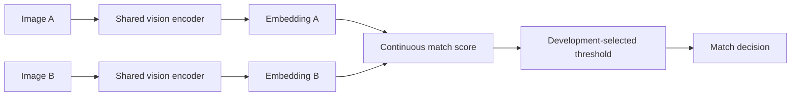

# Precise research brief — proposal for discussion

2026-10-10. This is a short discussion brief, not approval to train or evaluate.

**Proposed question:** Can adapting a pretrained vision encoder for fingerprint
verification approach VeriFinger performance on previously unseen Precise
subjects, and does adding structured minutiae improve TAR at the same FAR?

**Why this question:** The project already compares prompted VLMs and frozen
vision embeddings. The proposed contribution would test fingerprint-specific
learning first, then measure the additional benefit of minutiae. A vision
encoder inherited from a VLM would preserve a connection to foundation-model
adaptation; a dedicated fingerprint encoder is an alternative requiring the
professor's agreement. Language generation is not required for an embedding
matcher. No particular model, loss or training budget is selected here.

**Candidate pipeline:** Start with an image-only shared encoder. If the task is
per-finger matching, retain the parent slap, match corresponding finger positions
and combine scores into a slap score. Add an image-plus-minutiae arm only after
the image-only baseline is reproducible. Whole-slap embedding matching remains
a comparison arm, subject to the agreed scope. These are alternatives, not
implemented segmentation or architecture.

**Comparison:** Konain reports full-slap VeriFinger fused scores and sums of
per-finger scores. The supplied screenshot reports 2,057/2,100 genuine accepts
(97.9524% TAR) and 0/2,100 impostor accepts for both, at thresholds 48 and 79.
His message names 0.1% FAR; the screenshot names 0.01%. These are collaborator
observations, not reproduced repository results. We need exact score records,
threshold provenance and subject/image overlap before adopting the benchmark.

**Evaluation sketch:** Partition subjects before constructing pairs. Training
learns weights, development selects checkpoints/settings/thresholds, and final
test evaluates the frozen system on different subjects. Keep all hands,
captures and derivatives of a subject together. Compare methods on identical
slap comparisons; retain per-finger scores where applicable. Report ROC/DET,
EER, actual test TAR/FAR, trial counts, failures and uncertainty. Existing pair
exclusion alone does not establish a subject-disjoint protocol.

**Preparation evidence:** All 7,358 local JPEG headers opened as 1600×1500
grayscale images; none contained DPI metadata. All 35 selected images decoded.
Visual inspection found contrast, placement, ridge-continuity and contact-area
variation. Actual PPI, acquisition sessions and independent captures remain
unverified. The [inspection report](../../reports/precise-inspection-20261010/README.md)
contains aggregate evidence; identifying review artifacts stay local.

**Decisions for the professor/collaborator:** Must the contribution retain an
LLM/VLM component? Is the first matcher whole-slap or per-finger with fusion?
Which subjects/images have already been exposed to training or repeated testing?
Which FAR target and threshold-selection procedure apply? What capture metadata,
SDK exports and training objective are available? Split sizes and actual subject
assignments remain undecided.

Supporting explanations are in the [pipeline primer](fingerprint_matching_primer_20261010.md)
and [protocol sketch](precise_protocol_sketch_20261010.md). Fingerprint-specific
embeddings have precedent in [DeepPrint](https://arxiv.org/abs/1904.01099);
that paper motivates this direction without establishing achievable Precise performance.
